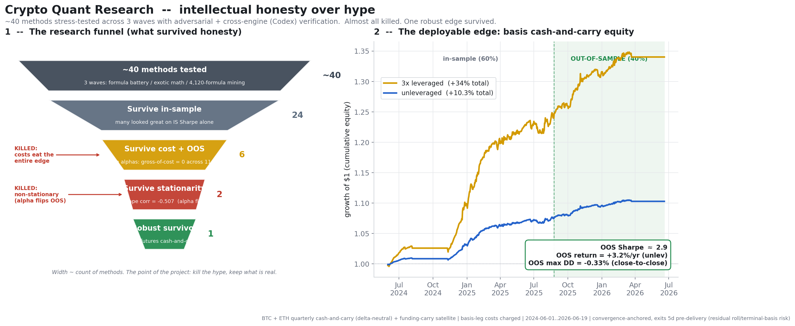

# Crypto Carry Research - an honest hunt for a real edge

> I ran **~40 methods across 3 waves** of crypto alpha research - from WorldQuant-style
> formula mining to RMT, path signatures, TDA, Hawkes processes and order-flow
> imbalance - under **deflated-Sharpe statistics + cross-engine adversarial
> verification**, proved that the cross-sectional formula alphas are **non-stationary
> and untradeable** (in-sample-vs-out-of-sample quintile-shape correlation **-0.507**,
> negative **gross of cost**), and isolated the **one structurally defensible edge**:
> convergence-anchored **quarterly-futures cash-and-carry basis** (every *settled*
> contract in-sample positive, ~3%/yr unlevered after costs) - packaged as a
> read-only, order-gated live engine.

> ⚠️ **Status: a promising research artifact, NOT a proven deployable edge.** The
> surviving edge has a convergence *anchor* (settlement), but the deployed rule
> **exits 5 days before delivery**, so it does not capture the settlement print - it
> carries residual terminal-basis / roll / execution risk. Headline numbers are
> out-of-sample and net of modeled costs, but there is **no live fill data**.

**This project's value is not a magic edge - it's the machinery to tell a *real* edge
from a *fitted* one, used to kill my own hype.** Most quant portfolios show one
cherry-picked backtest. This one shows the kills - and revised its own headline down
when an adversarial review caught its overclaims (see *Limitations*).



*Left: ~40 methods -> almost all killed (formula alphas gross-of-cost = 0; signal
inverts out-of-sample) -> 1 surviving structural premium. Right: the basis-carry book,
OOS region shaded, OOS Sharpe ~2.9 after basis-leg costs.*

---

## What survived, and what died (honestly)

| Family | Methods tried | Verdict | Why |
|---|---|---|---|
| **Quarterly basis cash-and-carry** | calendar/term-structure | ✅ **DEFENSIBLE** | settlement gives a convergence *anchor* -> entry basis is *largely* earned; every **settled** BTC/ETH contract in-sample was positive. ⚠️ deployed rule exits 5d pre-delivery -> residual terminal-basis/roll risk (it is **not** "regardless of price path") |
| Funding-rate carry | static / hysteresis / x-sectional | ⚠️ marginal | real risk premium but **regime-dependent** (bled ~-1.2 Sharpe in recent OOS); the hysteresis short-spot leg needs borrow (~3.5%/yr) **not modeled** in the indicator -> not a clean deployable edge |
| Cross-sectional formula alphas | **4,120 formulas**, 11 angles | ❌ **DEAD** | **non-stationary**: IS-vs-OOS quintile-shape corr **-0.507**, gross-of-cost ~= 0; both textbook cures (stability-selection, walk-forward) also ~= 0 |
| Exotic math | RMT+OU, path signatures, TDA, Hawkes, fracdiff, wavelet, entropy, optimal transport, MFDFA, EVT | ❌ DEAD | correct implementations (signature == Chen to 1e-9; MFDFA validated on cascades) - but no extractable predictive content |
| Momentum / reversal / cointegration pairs | TS/XS momentum, OU pairs, Kalman | ❌ DEAD | fragile / huge drawdowns / spreads break OOS |
| Order-flow imbalance (OFI) | taker + maker market-making | ❌ DEAD (retail) | fee-walled as taker; OFI adds **zero** value to market-making; viability is pure maker-rebate (infrastructure, not signal) |

**The through-line:** *within the universe, frequencies, cost models, data sources and
method families tested here*, no tradeable predictive alpha survived - only a
**structural risk premium with a settlement convergence anchor**. (This is a finding
about *this search*, not a proof that "all public-kline formulas are exhausted" - the
program-level multiple-testing penalty is larger than any single PSR suggests.)

---

## The credibility backbone (look here first)

1. **Deflation is real, not decoration.** [`engine/backtest.py`](engine/backtest.py)
   implements the Probabilistic Sharpe Ratio and a Bailey-Lopez-de-Prado **Deflated
   Sharpe** benchmark, with a self-test that **PASSES a genuine small edge and REJECTS
   pure noise**. Positions are shifted 1 bar (no look-ahead); turnover cost is charged.
2. **The non-stationarity kill is the intellectual centerpiece.**
   [`experiments/alpha_stable.py`](experiments/alpha_stable.py) shows the formula signal
   is *real in-sample* (IS-A vs IS-B cross-formula IC corr **0.901** - not noise) yet the
   tradable quintile shape **regime-flips out-of-sample** (corr **-0.507**) and loses
   gross of cost. Both correct cures were applied and **shown to fail**: stability-
   selection (gross -0.33) and monthly walk-forward re-fit (gross ~= +0.08).
3. **Cross-engine adversarial verification.** Every positive candidate was attacked by an
   independent **Codex** refuter (`reports/codex_refute_*.md`). It killed results I then
   conceded - e.g. short-spot borrow (~3.5%/yr) wiping a funding-carry "edge"; a COIN-M
   settlement-print bar being 54% of a candidate's PnL.
4. **Deterministic engineering gate (Probity).** [`probity_gate/`](probity_gate/) is a
   **zero-LLM, mutation-tested** ruler gating 6 governance invariants - cost-on-turnover,
   live-order hard-gating, chronological OOS, deflation primitives, keyless public data,
   non-normality-robust statistics. The mutation sieve **kills all 6 mutants**; verdict =
   **PASS** ([`reports/PROBITY_GATE_REPORT.md`](reports/PROBITY_GATE_REPORT.md)).

---

## The defensible edge: quarterly cash-and-carry basis

- **Mechanism:** long spot / short dated quarterly future. The exchange **settlement rule**
  pulls the future toward the spot index at delivery, giving the entry basis a convergence
  **anchor**. This is a *risk premium*, **not** arbitrage and **not** a prediction.
- **Honest caveat (corrected after review):** the deployed playbook **exits ~5 days before
  delivery** (`exit_dte=5`) to avoid settlement-print noise - so it does **not** realize the
  guaranteed settlement convergence. "Regardless of price path / structurally locked" was an
  overclaim; the exit leaves **terminal-basis, roll-timing, liquidity and execution risk**.
- **Evidence:** every *settled* BTC/ETH quarterly in-sample was positive (the 1-2 nearest
  contracts are still **open/live**, shown for completeness, not as settled proof). End-to-end
  backtest (basis core + funding satellite, **basis-leg costs now charged**, chronological
  60/40 OOS): **OOS Sharpe ~2.9, +3.2%/yr unlevered, +9.5%/yr at 3x**, over 2024-06...2026-06.
  *(The pre-review headline of Sharpe ~4 / +4.1%/yr omitted basis-leg transaction costs; it
  has been corrected down.)*
- **Live:** [`engine/basis_carry_live.py`](engine/basis_carry_live.py) emits a target book
  (read-only; order placement hard-gated). Cross-exchange scanner
  [`engine/xexch_monitor.py`](engine/xexch_monitor.py) covers Binance + OKX + Bitget.
  Playbook: [`reports/BASIS_CARRY_PLAYBOOK.md`](reports/BASIS_CARRY_PLAYBOOK.md).

---

## Limitations (printing these *is* the portfolio value)

- **Exits before settlement.** The convergence guarantee only holds if you hold to delivery;
  the deployed rule exits 5d early, so the edge is convergence-*anchored*, not settlement-
  *locked*. Residual roll/terminal-basis risk is real.
- **No live fills.** Read-only by design (`place_order` raises `NotImplementedError`).
  Slippage, partial fills, borrow availability, and funding-timestamp execution are
  *modeled*, never observed. Nothing here has traded.
- **The < 1% max drawdown is cosmetic.** It is close-to-close and delta-neutral; it does
  **not** capture the intra-bar short-futures-leg liquidation path at leverage. The real risk
  is margin management. This is a thin (~3%/yr unlevered), capital-intensive carry.
- **One OOS regime (~2 years).** The basis edge has not seen a violent backwardation /
  deleveraging cascade out-of-sample. The combined book's period-sensitivity is real
  (it collapses toward ~0 Sharpe in some sub-windows).
- **Program-level deflation is not airtight.** Each script deflates within its local variant
  grid; across 40+ methods and 4,120+ formulas the family-wide penalty is larger than any
  single PSR = 1.0 suggests. The surviving edge is defended *mechanistically*, not purely
  statistically.
- **Costs were initially incomplete.** The first release omitted basis-leg entry/exit/roll
  costs in the end-to-end book; an adversarial review caught it and the headline was revised
  down (Sharpe 3.96 -> 2.94). Cross-exchange / COIN-M inverse legs are scanned live but not
  yet backtested.

---

## Quickstart

```bash
pip install -r requirements.txt

# engine self-checks (offline, deterministic)
python engine/stats.py
python engine/backtest.py                # PSR/Deflated-Sharpe: PASSES a real edge, REJECTS noise

# the defensible edge
python experiments/basis_carry_spec.py   # per-contract validation (uses cached data)
python experiments/basis_carry_backtest.py   # end-to-end OOS book, basis-leg costs charged
python engine/basis_carry_live.py        # live target book (read-only; needs internet)
python engine/xexch_monitor.py           # Binance+OKX+Bitget carry dashboard

# the kills (reproduce the honesty)
python experiments/alpha_stable.py       # the -0.507 non-stationarity proof
python experiments/maker_ofi.py          # OFI adds no value to market-making

python experiments/make_showcase.py      # regenerate reports/showcase.png
```

All market data is fetched from **public, keyless, read-only** exchange endpoints and
cached locally (`data/cache/`, git-ignored). No API keys, ever.

---

## Repository map

```
engine/        data fetchers (Binance/Bybit/OKX public), math toolkit, backtester
               (PSR/Deflated-Sharpe), live basis-carry engine, cross-exchange scanners
experiments/   the 3 waves of candidates (battery, exotic math, 4120-formula mining,
               OFI) + the surviving carry books + the showcase generator
probity_gate/  zero-LLM, mutation-tested governance gate (6 invariants, verdict PASS)
reports/       REPORT.md (full 23-section write-up, zh), BASIS_CARRY_PLAYBOOK.md,
               PROBITY_GATE_REPORT.md, showcase.png, and per-candidate result JSONs
```

- **Deep dive:** [`reports/REPORT.md`](reports/REPORT.md) - the full research log (Chinese).
- **License:** MIT ([`LICENSE`](LICENSE)). **Disclaimer:** [`DISCLAIMER.md`](DISCLAIMER.md) - research only, not financial advice, no live trading.
